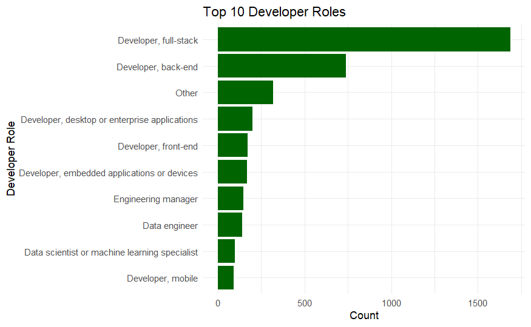
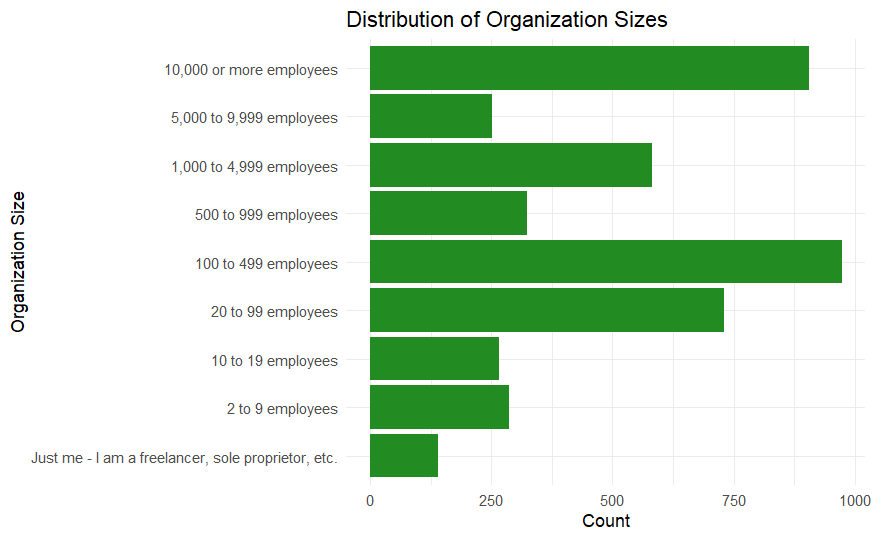
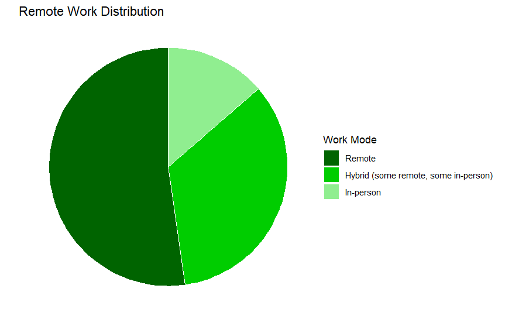

#  Developer Salary Prediction (Stack Overflow 2024)

Predicts developer salaries in the United States using the 2024 Stack Overflow Developer Survey. This project explores how background variables such as experience, role, education level, company size, and remote work arrangement influence annual compensation.

## 📌 Project Highlights

- 🧠 Built a predictive model using XGBoost regression  
- 📊 Cleaned and transformed survey data from 65,000+ responses  
- 🚀 Deployed as both a **Shiny App** and **Plumber API** using Hugging Face  

---

## 🗃️ Data Source & Metadata

The dataset comes from the [2024 Stack Overflow Developer Survey](https://survey.stackoverflow.co/2024/), released by the #TidyTuesday community.

- 65,000+ responses worldwide  
- U.S.-only data filtered for analysis (~4,400 rows)  
- Survey includes:  
  - Single-answer formatting  
  - Label mappings via crosswalk  
  - Survey metadata  

**Key Files Used:**
- `stackoverflow_survey_single_response.csv` – core dataset  
- `qname_levels_single_response_crosswalk.csv` – label decoder  
- `stackoverflow_survey_questions.csv` – metadata  

---

## 📊 Dataset Overview

After cleaning and preprocessing, we kept U.S.-based developers with valid salary data. Below are the final variables used for modeling:

| Variable              | Description                                         | Type        |
|----------------------|-----------------------------------------------------|-------------|
| `years_code_pro`     | Years of professional coding experience             | Numeric     |
| `years_code_pro_sq`  | Experience squared (engineered for nonlinearity)    | Numeric     |
| `dev_type_grouped`   | Primary developer role (23 levels)                  | Categorical |
| `org_size_label`     | Organization size (9 levels)                        | Categorical |
| `ed_level_label`     | Education level (6 levels)                          | Categorical |
| `remote_work_label`  | Work setup (Remote, Hybrid, In-person)              | Categorical |

All categorical variables were converted to factors, then one-hot encoded for modeling.

---

## 📈 Sample Visualizations

#### 🔹 Top Developer Roles  

#### 🔹 Organization Size Distribution  

#### 🔹 Remote Work Setup  

#### 🔹 Salary by Remote Work Arrangement  

---

## ⚙️ Modeling Approach

After experimentation, XGBoost was selected as the final model due to:

- Strong tabular data performance  
- Robustness to feature noise  
- Ability to capture non-linear trends  

### 📌 Pipeline Overview

1. Data cleaning & wrangling  
2. Feature engineering (e.g., squared terms)  
3. Train/test split (80/20)  
4. XGBoost training with tuned hyperparameters  

### 📊 Model Performance

- **R²** = 0.319 (explains ~32% of salary variance)  
- **RMSE** ≈ $57,385  

These results reflect realistic limitations of survey-based predictions, which may miss hidden or unrecorded salary drivers. Still, the model captures important salary patterns effectively.

---

## 🔗 Live Apps

- 🔍 [Shiny App (Interactive Tool)](https://huggingface.co/spaces/joooobin/salary-predictor-shiny)  
- 🧪 [Plumber API Endpoint](https://joooobin-salary-predictor-api.hf.space/__docs__)  
- 🐳 [API Docker Space](https://huggingface.co/spaces/joooobin/salary-predictor-api)

📷 QR Code to access Shiny App:  

